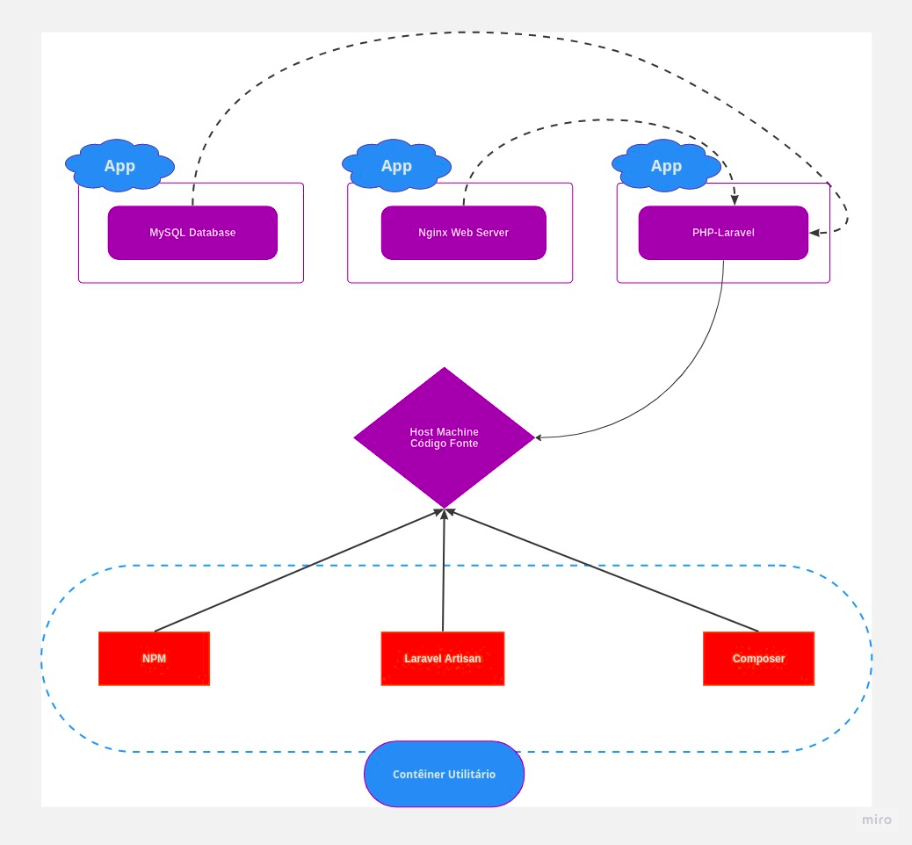

##### Laboratório - Laravel & PHP.


- Introdução

  *Esta será uma configuração que permitirá construir uma aplicação Laravel sem instalar nada localmente (host), exceto o Docker. O propósito é que tenhamos uma pasta no host que contém o código-fonte do aplicativo PHP-Laravel. A pasta do código-fonte será exposta a um contêiner do PHP-Laravel. E esse é um contêiner que terá acesso ao nosso código-fonte irá gerar uma resposta para as solicitações recebidas. Teremos um segundo contêiner, que será o Nginx, que é um servidor web, que basicamente receberá solicitações de entrada, e em seguida, vá para o contêiner do PHP  gerar uma resposta e enviá-la de volta aos clientes que enviaram uma solicitação.*

  *Para armazenar dados, vamos adicionar um banco de dados MySQL. E o contêiner PHP-Laravel no final precisa ser capaz de se comunicar com o banco de dados MySQL. Esses três contêineres serão de aplicativos. Não os usamos para funcionalidade de utilitário; em vez disso, esses contêineres permanecerão ativos e em execução enquanto  o aplicativo estiver ativo e em execução. Por quê eles estão lidando com solicitações de entrada, tratando dessas solicitações e gerando respostas com a ajuda do PHP-Laravel, e estão lidando com armazenamento de dados no banco de dados.*

  *Além desses três contêineres de aplicativo, nossa configuração também irá precisa de contêineres utilitários, no Laravel existem três tipos de ferramentas, utilitários, que serão necessários, por exemplo, precisamos do Composer. O Composer está basicamente para o PHP o que o NPM está para o Node. É um gerenciador de pacotes que podemos usar para instalar pacotes de terceiros e usaremos o Composer para criar o aplicativo Laravel e também o Laravel usará o Composer para instalar as dependências de que ele precisa. Além disso, o Laravel vem com sua própria ferramenta chamada Laravel Artisian. Este é um comando que usamos para executar migrações em nosso banco de dados e escrever os dados iniciais de partida no banco de dados.  E por último também usaremos o NPM. O Laravel usa para algumas de suas lógicas de front-end.*

- Comandos

  - Após baixar execute na pasta raiz do seu projeto:

  ```dockerfile
  docker-compose run --rm composer create-project --prefer-dist laravel/laravel:^8.0 .
  ```

  - Abra a pasta **src/.env** em seu editor e altere as linhas de configuração para a conexão do banco de dados, iguais a que você definiu na **env do projeto**, da seguinte forma:

  ```
  DB_DATABASE =*********
  DB_USERNAME =*********
  DB_PASSWORD =*********
  ```

  - Execute o projeto e acesse em http://localhost:8000 após o seguinte comando:

  ```
  docker compose up -d server
  ```

  - Caso precise alterar a imagem, você pode reconstruir com o seguinte comando:

  ```
  docker compose up -d --build server
  ```

​	
- Arquitetura

  


